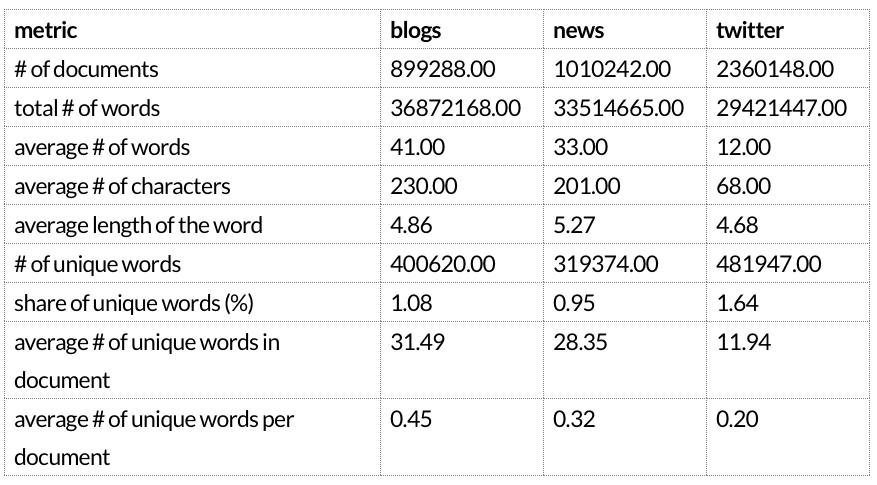
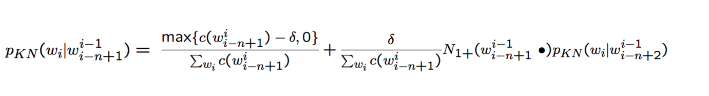
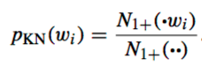

# TSafer (TypeSafer) 
## A Natural Language Processing system which predicts the next word you want to enter.

For training were used 50% blogs, 40% news and 60% twitter. That allowed to get 75% of unique words from all corpuses.

TSafer uses interpolated Kneser-Ney smoothing for 4,3,2,1 grams and back-off model for unseen words.
The higher ngrams coefficients are computed with the formula:

the lowest:                                                            

TSafer uses 

- precomputed values for Kneser-Ney coefficients for every word 
- stored in R data.table with hashed index
- with each query processed by recursive function

All these make it work realy fast.

For text processing regexp was used, RWeka for ngramization.

Learning and processing are paralled with doParallel.
